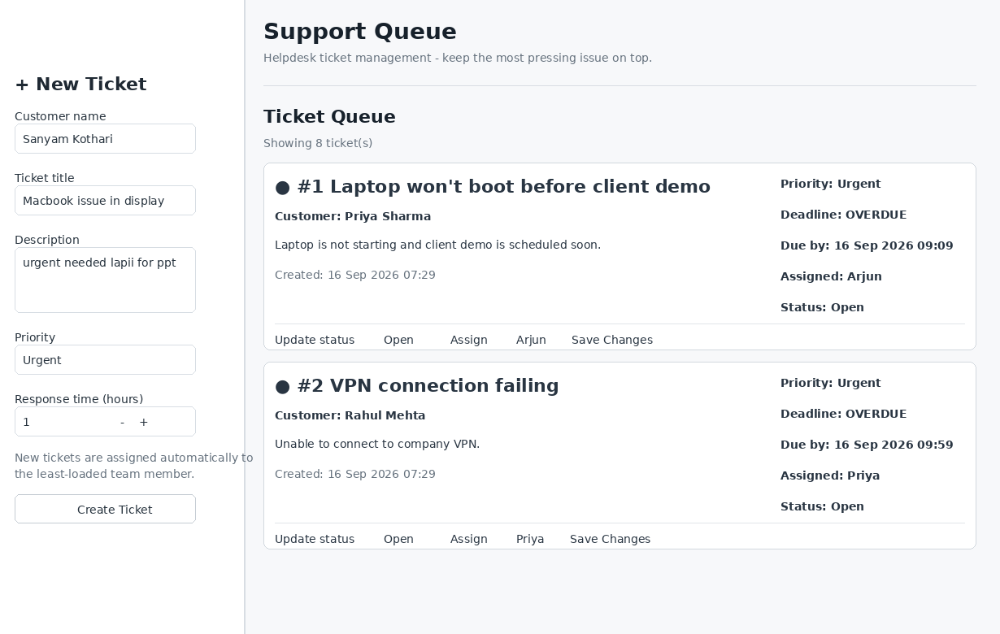

## Project

# Support Queue

## Problem

The helpdesk has many tickets with different priorities and response deadlines.

## Solution

The application automatically puts the most pressing ticket at the top.

## Screenshot



## Queue Rule

1. Overdue unresolved tickets
2. Urgent tickets
3. High tickets
4. Normal tickets
5. Earlier response deadline
6. Earlier creation time

## Features

- Create ticket
- Search
- Filter
- Assign
- Automatically assign new tickets to the least-loaded team member
- Update status
- Detect overdue tickets
- Automatically escalate overdue tickets one priority level per run
- Track response deadlines
- Persistent SQLite storage

## Run Instructions

```bash
pip install -r requirements.txt
streamlit run app.py
```

## Example Use Cases
## Example Use Cases

### Urgent issue
A customer's laptop does not boot before an important client demonstration. The ticket is marked Urgent and given a short response deadline.

### Normal request
A customer requests a larger monitor. This ticket is marked Normal and receives a longer response window.

### Overdue ticket
When a ticket passes its promised response time and is still unresolved, it is automatically identified as overdue and surfaced prominently.

## Design Decisions
The application intentionally uses a simple architecture suitable for a small helpdesk.

SQLite provides persistent local storage without requiring a separate database server.

Streamlit provides a fast web interface while allowing the queue logic to remain in Python.

## Future Improvements
Possible future extensions include:

- Authentication
- Role-based access
- Email notifications
- Audit history
- SLA reporting
- Multiple teams
- Advanced analytics
- REST API
